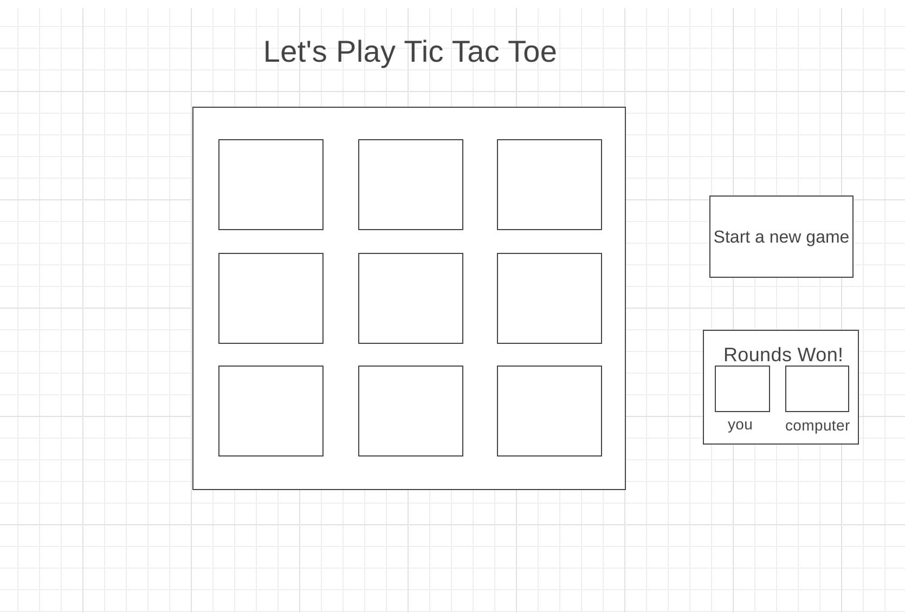

# Project: Tic-Tac-Toe

## Installation:

None needed, it is live via : Link is https://avrubio.github.io/Tic-Tac-Toe/

## Wireframe:

## Preview

This is a game of tic tac toe, with scoreboard counter and light and dark theme mode:

## Technology used:

Vanilla JavaScript
HTML
CSS

## Approach:

It looks like you've provided a detailed piece of JavaScript code that implements a Tic Tac Toe game with various features, including player turns, win detection, scoring, reset buttons, and a light/dark mode toggle. Let me break down the code for you:

1. **Setup and Variables:**

   - The code begins by setting up variables like `container`, `currentPlayer`, and score counters for both players.
   - The script also grabs references to various elements in the HTML using `document.querySelector` and `document.querySelectorAll`.

2. **Click Event Handling:**

   - The `handleClick` function is the core of the game logic. It's bound to the container element's click event.
   - Inside this function, the script checks if the clicked element is a game box that hasn't been marked already by either "x" or "o".
   - Depending on the current player, the corresponding class ("x" or "o") is added to the clicked box.
   - The player is then toggled (from "X" to "O" or vice versa).
   - After every move, the script checks for a win condition by iterating through the `winningCombos` array and using the `checkWinForIndices` function to see if any of the combinations match the current player's class.

3. **Win Detection and Scoring:**

   - The `checkWinForIndices` function takes an array of indices and a class name as parameters. It returns true if all boxes at the provided indices have the specified class.
   - The `checkForWin` function iterates through the `winningCombos` array and uses `checkWinForIndices` to check if any winning combinations are achieved. If so, it updates the title to announce the winner and increments the respective player's counter.

4. **Draw Detection:**

   - After checking for a win, the script checks if all boxes are filled. If so, it updates the title to indicate a draw.

5. **Reset Buttons:**

   - There are two reset buttons: one for resetting the game while keeping the score and another for resetting the entire game including scores.
   - Both reset buttons remove class names from boxes and reset the title.

6. **Light/Dark Mode Toggle:**

   - The toggleSwitch event listener listens for changes in the switch input element (checkbox).
   - If the checkbox is checked, the background color of the body and scoreboard is set to black, and text colors are adjusted for visibility. If unchecked, the colors are reset.

7. **Initial State and Event Listeners:**

   - The code sets the initial scores to 0 and attaches the `handleClick` function to the container's click event.
   - The reset buttons and toggle switch have their own event listeners that execute specific actions when clicked or changed.

8. **Note:**
   - The code seems to be well-organized and structured.
   - However, one thing to consider is that using the `.classList` approach for handling the game state (whether a box has an "x" or "o" class) can be a bit cumbersome. A more efficient approach might involve using a data structure to keep track of the game state, which could simplify some of the win detection logic.
   - Additionally, if you plan to expand or modify the game in the future, consider encapsulating functionalities into separate functions or classes to improve maintainability and readability.

## User Stories

As a user, I should be able to start a new tic tac toe game
As a user, I should be able to click on a square to add X first and then O, and so on
As a user, I should be shown a message after each turn for if I win, lose, tie or who's turn it is next
As a user, I should not be able to click the same square twice
As a user, I should be shown a message when I win, lose or tie
As a user, I should not be able to continue playing once I win, lose, or tie
As a user, I should be able to play the game again without refreshing the page

## What can be improved?

UI Design could be cleaner, will work on this later on.
